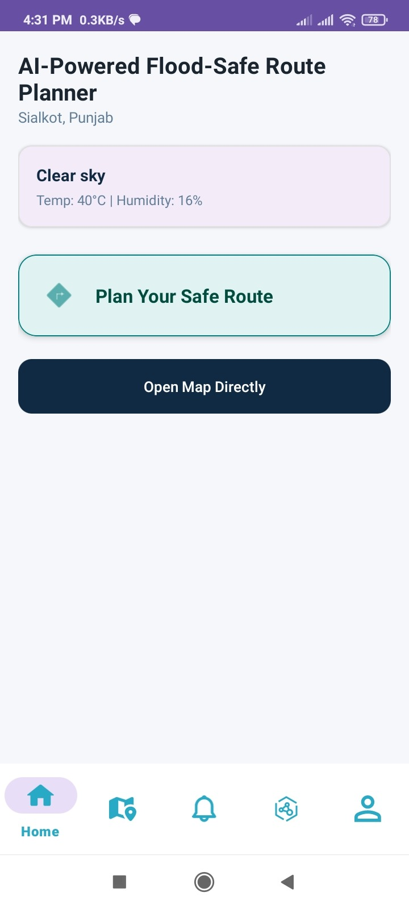
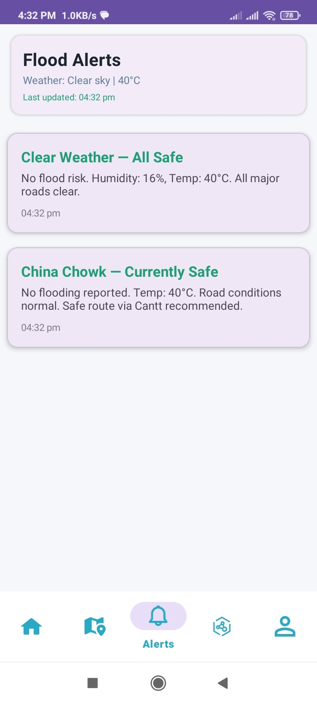
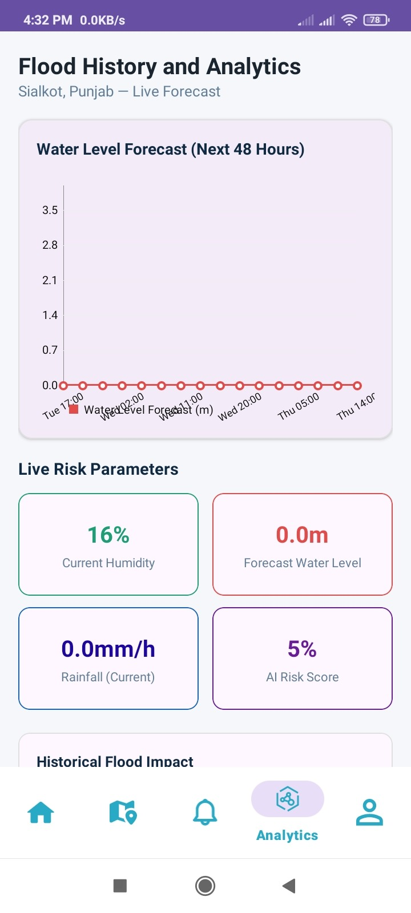
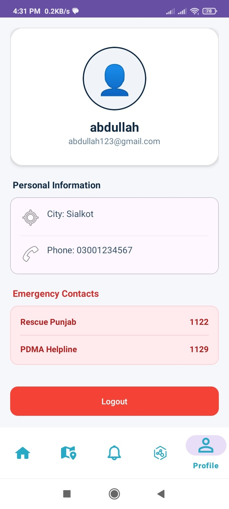

# 🌊 AI-Powered Flood-Safe Route Planner

> A Final Year Project building a smart, offline-capable Android navigation app that steers users away from flood-hit roads in **Sialkot City, Pakistan**.

---

## 📖 About the Project

Standard navigation apps like Google Maps and Waze don't factor in flooding at all — during monsoon season, they'll route you straight through a submerged street without warning. This app closes that gap by combining flood forecasting with route planning, so users always know which roads are actually safe to take.

Core capabilities:

- Forecasts flood likelihood and severity from environmental and historical data
- Represents the road network as a graph where elevation and flood-risk levels influence path cost, not just distance
- Calculates the safest route using a modified Dijkstra-based pathfinding approach
- Works fully offline, since flood-hit areas often lose internet access when it matters most

Built specifically for the moment when connectivity is unreliable and infrastructure is failing — exactly when flood conditions hit hardest.

---

## ❗ The Problem

Current GPS navigation tools fall short during floods in a few key ways:

- They assume every road is equally passable, with no awareness of flood conditions
- They depend on constant internet and cloud-based processing, which breaks down in disaster scenarios
- They only report road closures after the fact instead of predicting risk ahead of time

This project was built to fix that: a lightweight, prediction-driven system that keeps working even with poor connectivity and limited device resources.

---

## ✨ Core Features

- 🧠 **Flood Prediction** — Uses XGBoost and LSTM models to forecast rainfall and flood risk over time
- 🗺️ **Risk-Aware Routing** — Custom Dijkstra-based engine that factors elevation and flood-risk scores into route calculation, not just raw distance
- 📡 **Fully Offline** — On-device inference via TensorFlow Lite, with offline map rendering through OpenStreetMap
- ⚡ **Runs on Modest Hardware** — Built to perform well on mid-range Android devices, prioritizing accessibility
- 🌧️ **Live Alerts** — Pulls current weather and rainfall data for up-to-date risk info
- 📊 **Analytics View** — Shows flood history, rainfall trends, and past risk zones on a dashboard

---


## 📸 App Screenshots

> 💡 *Below is the visual showcase of the application interfaces, separated cleanly into dedicated modules.*

---

### 🔐 1. Authentication & Onboarding
> Users can sign up, log in, or explore the application using the offline-friendly Guest Mode.

<p align="center">
  
  
  
  
</p>

---

### 🏠 2. Home Dashboard
> The main landing hub presenting current weather conditions, immediate flood risks, and quick-action shortcuts.

<p align="center">
  
</p>

---

### 🗺️ 3. Maps & Routing Engine
> Offline interactive mapping, path planning configuration, and the final risk-aware route results.

<p align="center">
  
  
  
  
</p>

---

### 📊 4. Weather Alerts & Analytics
> Dedicated views for monitoring real-time precipitation alerts and reviewing historical flood data trends.

<p align="center">
  
  
</p>

---

### 👤 5. User Profile
> Managing user account details, preferences, and essential offline settings.

<p align="center">
  
</p>

---
## 🏗️ Architecture


```

┌─────────────────────────────────────────────────────────┐
│                     Presentation Layer                  │
│          (Fragments: Home, Maps, Alerts, Analytics)     │
└───────────────────────────┬─────────────────────────────┘
│  MVVM
┌───────────────────────────▼─────────────────────────────┐
│                      ViewModel Layer                    │
│               (State management, UI logic)              │
└───────────────────────────┬─────────────────────────────┘
│
┌───────────────┼───────────────┐
▼               ▼               ▼
┌───────────────┐┌───────────────┐┌───────────────────┐
│  TFLite Model ││ Risk-Weighted ││  OSM Offline Map  │
│  (Flood/Rain  ││ Dijkstra Router││     Rendering     │
│   Prediction) ││               ││                   │
└───────────────┘└───────────────┘└───────────────────┘

```

**Tech Stack:**

| Layer | Technology |
|---|---|
| Language | Kotlin |
| Architecture | MVVM |
| ML Inference | TensorFlow Lite |
| Prediction Models | XGBoost, LSTM |
| Routing Algorithm | Risk-weighted Dijkstra |
| Mapping | OpenStreetMap (offline) |
| Backend / Auth | Firebase (Firestore, Auth) |
| Charts | MPAndroidChart |

---

## 🛰️ Data Sources

Flood prediction relies on several public geospatial and weather datasets:

| Source | Used For |
|---|---|
| **NASA SRTM** | Elevation data for terrain modeling |
| **ESA WorldCover** | Land-use and land-cover classification |
| **HydroSHEDS** | River networks and drainage patterns |
| **OpenWeather API** | Real-time weather and rainfall |
| **PMD (Pakistan Meteorological Department)** | Historical rainfall and flood records |

---

## 📲 App Modules

- **Home** — Overview dashboard showing current flood risk
- **Maps** — Offline interactive map with route display
- **Plan Route** — Input source/destination for a flood-aware route
- **Alerts** — Live flood and weather alerts for Sialkot
- **Analytics** — Rainfall charts and historical risk trends
- **Profile / Auth** — Firebase-backed login and user profile

---

## ⚙️ Getting Started

### Prerequisites
- Android Studio (latest stable)
- Android SDK 24+
- A Firebase project (`google-services.json` not included — add your own)
- OpenWeather API key — [get one here](https://home.openweathermap.org/api_keys)

### Setup

1. Clone the repo:
```bash
   git clone [https://github.com/AqsaMehreen15/AI-Powered-Flood-Safe-Route-Planner.git](https://github.com/AqsaMehreen15/AI-Powered-Flood-Safe-Route-Planner.git)

```

2. Add your `google-services.json` to the `app/` directory (from Firebase console)
3. In the project root, create `local.properties` and add:

```properties
OPENWEATHER_API_KEY=your_api_key_here

```

4. Open in Android Studio, sync Gradle, run on emulator/device (minSdk 24+)

---

## 🎯 Design Priorities

This project was built with a few deliberate trade-offs in mind:

* Offline reliability over cloud-dependent processing
* Lightweight, low-compute models over larger, more complex ones
* Fast inference over marginal accuracy gains
* Risk-aware routing over simple shortest-path logic

These choices reflect real conditions in flood-hit areas — spotty connectivity, limited device power, and the need for quick, usable guidance.

---

## 👩‍💻 Author

**Aqsa Mehreen**
Final Year — BS Information Technology, University of Sargodha
Supervised by Dr. Bushra Jamil

---

## 📄 License

Developed as an academic Final Year Project. Free to explore for learning purposes. For reuse or collaboration inquiries, please reach out directly.
